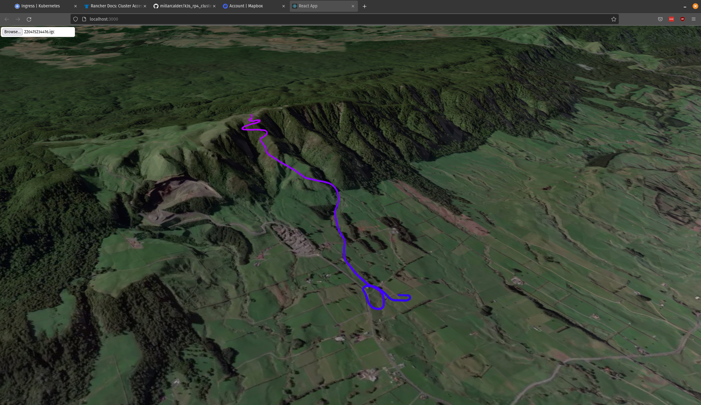

<h1 align="center">Flightlog<br></h1>

<h4 align="center">Web application for viewing IGC logs (commonly used in gliders and paragliders) on a 3D map.</h4>

<p align="center">
  
  
  
</p>

<p align="center">
  <a href="#key-features">Key Features</a> •
  <a href="#built-using">Built Using</a> •
  <a href="#developer-environment">Developer Environment</a> •
  <a href="#deploying">Deploying</a> •
  <a href="#helpful-links">Helpful Links</a> •
  <a href="#license">License</a>
</p>



## Key Features

This repository contains three different projects

 - **igc-parser** - a pip package for parsing IGC files
 - **viewer** - a website hosted on the internet for viewing IGC logs on a 3D map
 - **logbook** - a logbook tool I host on an internal network (currently under development)

## Built Using

- [FastAPI](https://fastapi.tiangolo.com/) - Web Framework
- [Uvicorn](https://www.uvicorn.org/) - Server
- [ReactJS](https://react.dev/) - JavaScript Framework
- [Mapbox](https://visgl.github.io/react-map-gl/) - Mapping Framework
- [S3](https://docs.aws.amazon.com/s3/) - Object Storage

## Developer Environment

Requirements:

 - [Devcontainers compliant code editor](https://containers.dev/)
 - [Ansible](https://www.ansible.com/)
 - [kubectl](https://kubernetes.io/docs/reference/kubectl/kubectl/) (connected to your Kubernetes cluster)
 - [Docker](https://www.docker.com/)

First you need to open the repository using devcontainers.

Each python project contains a make file with the following commands.
```bash
make developer-setup
make build
make test
```

## Deploying

Deploying is done via Ansible playbooks.

### Ansible Inventory File

 - `dev_machine` - machine to build python wheels and javascript bundles on
 - `build_machine` - machine to build docker images on
 - `viewer_webserver` - machine to deploy the viewer to

```
[dev_machine]
flightlog-dev ansible_connection=docker remote_user=root project_dir=/workspace/

[build_machine]
localhost ansible_connection=local

[viewer_webserver]
159.69.46.13 ansible_user=root
```

### Running the Playbooks

Before deploying the viewer or if you are building the docker images on the server, you must provision the server which you are deploying the viewer to.

After provisioning the VM you will need to setup the letsencrypt SSL certificate manually. [Certbot](https://certbot.eff.org/) is installed for you during the provisioning process.

```bash
ansible-playbook ansible/build_containers.yml -i ansible/inventory/foo.ini --ask-vault-password --ask-become-pass
ansible-playbook ansible/vm_provision.yml -i ansible/inventory/foo.ini --ask-vault-password --ask-become-pass
ansible-playbook ansible/vm_deploy.yml -i ansible/inventory/foo.ini --ask-vault-password --ask-become-pass
```

## Helpful links

https://xp-soaring.github.io/igc_file_format/index.html

## License

MIT
